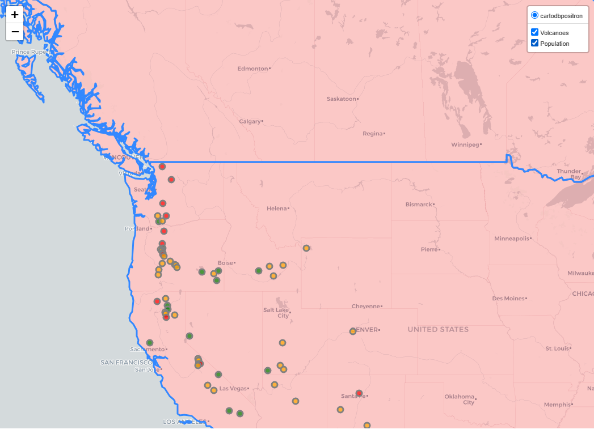

# Volcano and Population Map Project

This project uses **Python** and **Folium** to create an interactive map displaying the location and elevation of volcanoes in the United States alongside a world population map based on data from a GeoJSON file. The volcanoes are categorized by elevation, and countries are colored based on their 2005 population.

*Completed view of the Map*
## Files

- **Volcanoes.txt**: Contains latitude, longitude, and elevation data for volcanoes.
- **world.json**: GeoJSON file containing country data and 2005 population information.

## Features

1. **Volcano Map**: 
   - Volcanoes are represented as circular markers.
   - Marker colors change according to the volcano’s elevation: green (<1500 m), orange (1500-3000 m), and red (>3000 m).
 
*Volcanoes Off*                                             *Volcanoes On*

2. **World Population Map**: 
   - Each country is colored based on its 2005 population.
   - Green for populations up to 10 million, orange for up to 20 million, and red for over 20 million.

*Population filter off

## Code Structure

### Required Files

- **Volcanoes.txt**: Text file with volcano coordinates and elevation data.
- **world.json**: JSON file with geographic and population data for countries.

### Function `colour_producer(el)`

Defines the color of the volcano marker based on elevation (`el`):
- `Red` for elevations ≥ 3000 m
- `Orange` for elevations between 1500 m and 2999 m
- `Green` for elevations < 1500 m

### Map Layers

- **fgv (Feature Group)**: Contains circular volcano markers. Each marker has a `popup` displaying the elevation in meters.
- **fgp (Feature Group)**: Contains a world map in GeoJSON format, with fill color defined based on the country’s population in 2005.

## Execution

### Prerequisites

Ensure **Python** is installed, as well as the following libraries:

```bash
pip install folium pandas
